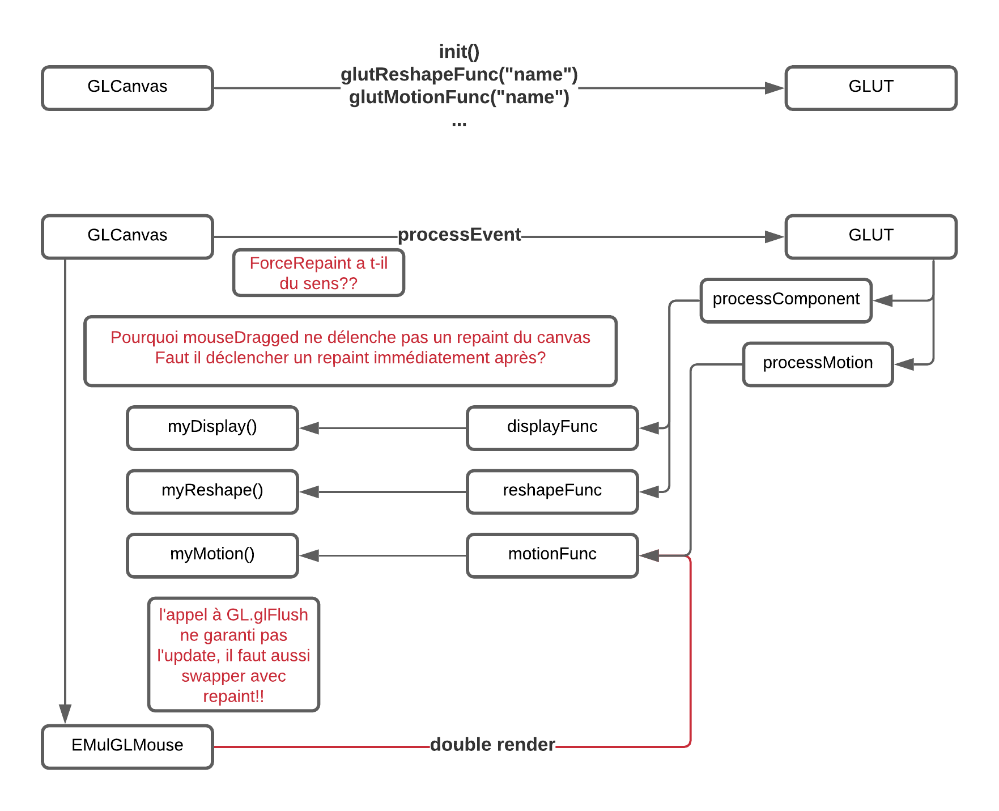

# jGL

A pure Java implementation of OpenGL, still [online](http://graphics.im.ntu.edu.tw/~robin/jGL/) with [example gallery](http://graphics.im.ntu.edu.tw/~robin/jGL/Example/index.html) and an [LGPL licence](http://www.gnu.org/licenses/lgpl-3.0.html)

# Javadoc and UML documentation
Javadoc with UML generated with [yFiles Doclet tool](https://www.yworks.com/downloads#yDoc).
Configuration file in doc/yfiles.uml.options.jgl.linux
Run ```javadoc @/Users/martin/Dev/jzy3d/public/jGL/doc/uml/yfiles.uml.options.jgl.linux```

## GL

GL is a java object that implements OpenGL 1 specification

<a href="https://lucid.app/lucidchart/78ec260b-d2d1-430d-a363-a95089dae86d/edit?page=rUUJ25QAVSeR#?folder_id=home&browser=icon">Edit schema</a>

## GLUT

GLUT is a java object that implements OpenGL 1 specification

<a href="https://lucid.app/lucidchart/78ec260b-d2d1-430d-a363-a95089dae86d/edit?page=L~uKE4~S_W9d#?folder_id=home&browser=icon">Edit schema</a>


## Crucial thing to know when trying to paint often

AWT repaint of all components are asynchronous. You do not decide when the component will draw.
Calling Component.repaint() too often might not lead  to a refreshing screen. Calling repaint() sends events to AWT
asking to draw when it can. If too many events are sent, the AWT event queue will coalesce all events into the last
one (or the one that requires painting the biggest part of the screen).

Refreshing the screen should be handled carefully. For example you can not simply update the screen as soon as the
mouse drags or move if building and drawing the 3d image takes to much time.

Despite not knowing exactly what is too much, I observed that having a rendering time above 40ms will lead to no
rendering at all until the Paint event  


## Features added to jGL since 2.5

### Error management

Ability to trigger runtime exception with stack trace when jGL interpret an OpenGL error.

```java
public abstract class gl_object {

	/**
	 * If true, will notify of any OpenGL error according to the configuration of
	 * {@link gl_object#exception}
	 */
	protected final boolean debug = true;
	/**
	 * If true, will trigger a {@link RuntimeException} upon any OpenGL error,
	 * otherwise send message to System.err.println(). In case
	 * {@link gl_object#debug} is set to false, all OpenGL errors are muted.
	 */
	protected final boolean exception = true;
}
```

Can debug using

```java
GLCanvas.postRenderString(Graphics g, String message, int x, int y);
```

or below mentionned 2d text management


### Text management : enable glutBitmapString-like text rendering.

Uses AWT Graphics2D.drawString() to draw text on top of the OpenGL color buffer (which is irself rendered in an image before) when glFlush() is invoked.

```java
/**
 * To be called by {@link GLUT#glutBitmapString(Font, String, float, float)} to
 * append text to a list of text to render at {@link GL#glFlush()} step.
 */
GL.appendTextToDraw(Font font, String string, int x, int y) ;
GL.appendTextToDraw(Font font, String string, int x, int y, float r, float g, float b)

```

Also


### Fix clear color by drawing the clear color in G2D.

This is not clean but we could not identify how to make background color work properly when integrating in Jzy3d (clear color was not applied and let instead a weird alpha value on pixel that are not rendered into by the scene).


### Image rendering based on AWT

to workaround the limitation of not being able place the image in screen using glRasterPos that jGL does not implement.


```java
GL.appendImageToDraw(BufferedImage image, int x, int y);
```
is added to let
 ```java
GL.glFlush()
```
 draw a BufferedImage on top of the OpenGL color buffer (the 3d scene).


## Limitations observed with jGL while embedding in Jzy3d

* Can not "mix" two viewports standing next to each other. The last rendered viewport erase the preceding. If the second viewport does not render ON TOP of the first one, the first one is replace by the clear (?) color.
* glRasterPos is not implemented in jGL, which is annoying for positioning a 2d image that should be rendered with glDrawPixels. See GL.appendImageToDraw

### Following bug appear when integrated in Jzy3d, but not in standalone prototypes

* glClear does not properly clear image background. Instead the background remains translucent AND multiple successive images overlap. Adressed by painting background with AWT fillRect
* Alpha blending not working properly. When integrating in Jzy3d, Elements with Alpha=0 appear as black instead of fully translucent. 


# Original readme file


                      jGL 3D Graphics Library for Java 2.4

                   Copyright (C) 1996-2002 Robin Bing-Yu Chen

                               Red Book Examples


INTRODUCTION
============

These examples are all in the OpenGL Programming Guide (the red book),
published by the Addison-Wesley Professional; ISBN 0-201-60458-2.


HOW TO COMPILE THE EXAMPLE SOURCE CODES
=======================================

Before compiling the source codes, please make sure that Sun Java2 SDK has been
installed in the machine and acceptable. Since jGL has been developed on Java2
platform, Sun Java2 SDK, Standard Edition is recommended, and the official web
site is:

  http://java.sun.com/j2se/

Before making the example source codes, don't forget to download jgl.jar, the
pre-compiled byte-code jar-ball. The newest version will be at

  http://nis-lab.is.s.u-tokyo.ac.jp/~robin/jGL/pub/jgl.jar or
  http://www.cmlab.csie.ntu.edu.tw/~robin/jGL/pub/jgl.jar

To compile all the example source codes, please edit Make-config as necessary
to make sure that the path of Java2 SDK in the local file system are set
right. Then, just make the codes by

  make.

It will make all the example source codes, and generate Java Plug-in HTML
files.


HOW TO COMPILE THE SOURCE CODES ON MICROSOFT WINDOWS SYSTEM
===========================================================

Please edit make.bat to make sure that the path of Java2 SDK in the local file
system are set right. Then, just make the codes by

  make.

It will make all the example source codes, and generate Java Plug-in HTML
files.


RUN THE EXAMPLES
================

To run the examples, please edit the booktest script (or booktest.bat) file to
make sure that the path of Java is correct. Don't forget to put the jgl.jar in
the same directory as these examples. Then, type

  booktest hello (for example)


OTHER INFORMATIONS
==================

If you have any problem, please mail to
  robin@is.s.u-tokyo.ac.jp or
  robin@csie.ntu.edu.tw

If you want to get the newest information, please refer to
  Http://nis-lab.is.s.u-tokyo.ac.jp/~robin/jGL or
  Http://www.cmlab.csie.ntu.edu.tw/~robin/jGL


------------------------------------------------------------------------
Nov. 25, 2002 by Robin Bing-Yu Chen at NIS-Lab......
